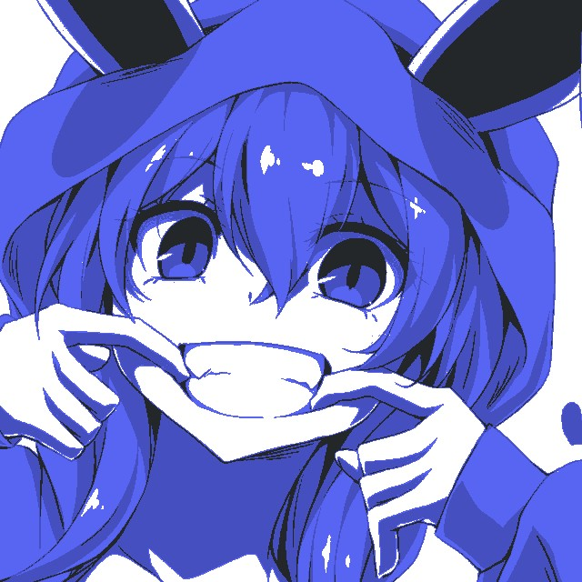
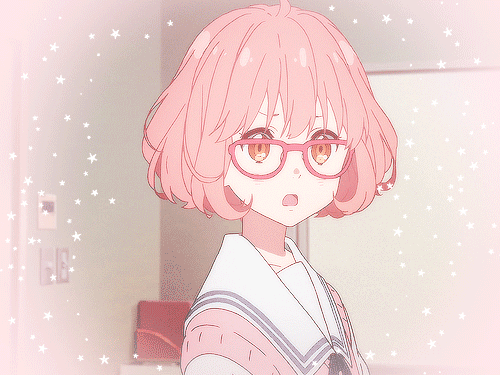
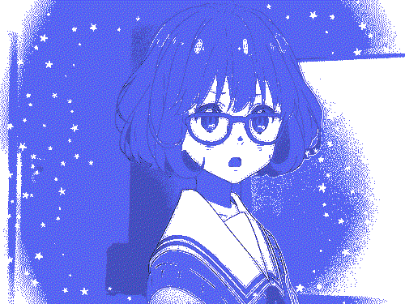

# Neko-Love API V4 (Go / Fiber Rewrite)

> A community-powered rewrite of the original Neko-Love API, rebuilt in Go with the Fiber web framework.

---

## 🌟 What is this?

This project is a **modern reimplementation of my Neko-Love API**, which was once hosted at `neko-love.xyz`. It served random anime-style images like "neko", "hug", "kiss", and more — often used in Discord bots, anime projects, and other community tools.

The original API was written in Node.js using Koa. This version is a **fresh and solid base built with Go and the Fiber framework**, designed for others to easily clone, customize, and host themselves.

---

## 🔧 Goals

- Provide a **lightweight and fast** REST API to serve random images.
- Offer a **clean modular structure** for adding new routes, categories, and assets.
- **SFW only**: This version contains strictly Safe For Work content.

---

## ⚠️ Please Note

This API **is not hosted by the original author**.

> It is provided as an open-source base only. You are free to clone, modify, self-host, and integrate it into your own projects.

---

## 🚀 Quick Overview

- Each route returns a **random image with metadata** from a locally cached folder (e.g. /assets/neko/), improving response times by avoiding repeated disk reads.
- Example JSON response:

```json
{
  "name": "04.webp",
  "category": "neko",
  "path": "/api/v4/images/neko/04.webp",
  "size": "438.2 KB",
  "mime_type": "image/webp",
  "modified_at": 1720018294
}
```

- Images are served directly at:

```
/api/v4/images/<category>/<image>
```

- To get a random image and its metadata, use:

```
GET /api/v4/<category>
```

---

## 🚩 Why a new version?

> After the original API was shut down, several community members asked if they could bring it back. Unfortunately, the original source code was lost. This rewrite aims to provide a fresh, modern foundation.

- ✅ Easier to maintain
- ✅ Fast and lightweight (Go + Fiber)
- ✅ Clean structure for contributions

---

## 💻 Run Locally

### Requirements

Make sure you have **Go installed** (version 1.18+ recommended):  
→ [Download Go](https://golang.org/dl/)

---

### Installation

1. Clone the repository:

```bash
git clone https://github.com/Otaku17/neko-love.git
cd neko-love
```

2. Install dependencies:

```bash
go mod tidy
```

3. Run the API:

```bash
go run main.go
```

4. Add your images in the corresponding folders inside the `assets/` directory (e.g. `assets/neko/`, `assets/hug/`, etc.)

---

## 🎨 Filters

The API also includes an **image filtering endpoint**:

```
GET /api/v4/filters/:filter?image=<url>
```

### ✅ Supported formats

- JPEG
- PNG
- WEBP
- **GIF** (animated) – frame-by-frame filtering is supported.

### 🧪 Available Filters

| Filter          | Description                                |
| --------------- | ------------------------------------------ |
| `blurple`       | Applies a Discord blurple color overlay    |
| `fuchsia`       | Pinkish-magenta recoloring                 |
| `glitch`        | RGB split + distortion effect              |
| `poppink`       | Vivid pink saturation filter               |
| `deepfry`       | Chaotic contrast & saturation (meme style) |
| `posterize`     | Reduces color depth to a flat retro look   |
| `pixelate`      | Low-resolution pixel art effect            |
| `vaporwave`     | Purple-cyan retro 90s aesthetic            |
| `anime_outline` | Adds bold anime-style black outlines       |
| `crimson`       | Strong red tint overlay                    |
| `amber`         | Warm orange-yellow tint overlay            |
| `mint`          | Soft turquoise-green pastel tint           |
| `aqua`          | Bright cyan/teal tint overlay              |
| `sunset`        | Pink-orange gradient inspired by sunsets   |
| `bubblegum`     | Light pastel pink & blue tint              |
| `negative`      | Inverts all colors (negative image)        |
| `greyscale`     | Converts image to grayscale                |

---

### 📷 Example Renders

#### JPEG (PNG/JPG...)

|                Original                 |            With `blurple`             |
| :-------------------------------------: | :-----------------------------------: |
|  |  |

#### GIF

|               Original                |           With `blurple`            |
| :-----------------------------------: | :---------------------------------: |
|  |  |

The following filters are currently implemented and showcased in the [`Examples`](example/) folder of the project:

You can test a filter with a public image URL like this:

```
http://localhost:3030/api/v4/filters/deepfry?image=https://example.com/image.png
```

---

## 🤝 Contributing

Want to add a new image category?

1. Create a folder inside `assets/<name>`
2. Add your image files there

No extra routes need to be added to the code since they are managed automatically.

Thanks to everyone who used the original Neko-Love, and to all those who want to bring it back with a new twist ✨

---

## 🔍 Example API Call

To get a random image (returns a JSON object with metadata):

```
GET http://localhost:3030/api/v4/neko
```

To access the image directly (after receiving the path from the JSON response):

```
GET http://localhost:3030/api/v4/images/neko/04.webp
```

---

## 🔄 Another version of the project:

- Rust (Framework Axum) by [reinacchi](https://github.com/reinacchi/Neko-Love/tree/main)
